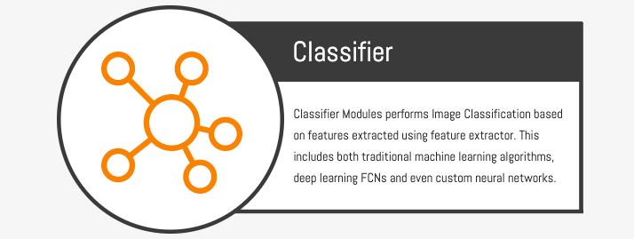

# Core Module <small> radtorch.core </small>

<!-- !!! bug "DOCUMENTATION OUT OF DATE"
    Documentation not updated. Please check again later. -->

<!--  -->

<!-- <div style="text-align:center"></div> -->

```
from radtorch import core
```
The core module has all the core functionalities of RADTorch framework. These include:

1. Data_Processor

2. Feature_Extractor

3. Classifier

4. NN_Classifier

5. Feature_Selector


<!-- 

 -->


## Data_Processor

<div style="text-align:center"></div>

```
core.Data_Processor(data_directory, is_dicom=True,
  mode='raw', wl=None, table=None, image_path_col='IMAGE_PATH',
  image_label_column='IMAGE_LABEL', valid_percent=0.2, test_percent=0.2,
  normalize=((0.5, 0.5, 0.5), (0.5, 0.5, 0.5)), balance_class=False,
  type='logistic_regression', model_arch='alexnet',
  batch_size=16, custom_resize=False,
  transformations=transforms.Compose([transforms.ToTensor()]))
```
<!-- <p style='text-align: justify;'>
The Data_Processor class acts as the first step in all image analysis pipelines. The purpose of the data_processor is to perform dataset preparation for feature extraction and further analysis.
</br>
</br>
Data preparation includes: data augmentation, transformation, resize, splitting, normalization and class balance through oversampling.
</br>
</br> -->


??? quote "Parameters"

    - **data_directory**: _(str)_ path to folder which contains the data images.

    - **is_dicom**: _(boolean)_ True if images are DICOM. False if any other type. (Default=True)

    - **mode** _(str)_  output mode for DICOM images only where 'RAW'= Raw pixels, 'HU'= Image converted to Hounsefield Units, 'WIN'= 'window' image windowed to certain W and L, 'MWIN' = 'multi-window' converts image to 3 windowed images of different W and L (specified in wl argument) stacked together. (default='RAW')

    - **wl** _(list)_ list of lists of combinations of window level and widths to be used with 'WIN' and 'MWIN'.In the form of : [[Level,Width], [Level,Width],...]. Only 3 combinations are allowed for 'MWIN' (for now). (default=None)

    - **table**: _(path to csv or name of pandas table)_ The table to be used for image paths and labels. By default, this is **None** which means the Data_Processor will create the datasets and labels from folder structure as shown [here](https://pytorch.org/docs/stable/torchvision/datasets.html#torchvision.datasets.ImageFolder).

    - **image_path_col**: _(str)_  name of the column with the image path. (default='IMAGE_PATH')

    - **image_label_column**: _(str)_  name of the label/class column. (default='IMAGE_LABEL')

    - **test_percent:**: _(float)_ percentage of dataset to use for testing. Float value between 0 and 1.0. (default=0.2)

    - **valid_percent:**: _(float)_ percentage of dataset to use for validation. Float value between 0 and 1.0. (default=0.2)

    - **transformations:** _(pytorch transforms list)_ pytroch transforms to be performed on the dataset. (default=Convert to tensor)

    - **custom_resize:**: _(int)_ by default, the Data_Processor will resize the input images into the default training model input image size. This default size can be changed here if needed.

    - **batch_size:**: _(int)_ batch size of the dataset (default=16)

    - **normalize**: Image normalization. By default, the Data_processor will normalize images with mean and standard deviation = 0.5. If you want the data to be normalized to the mean and std of the dataset itself, change this to 'auto'. Specific of mean and std can also be passed in the form of ((0.5, 0.5, 0.5), (0.5, 0.5, 0.5)). If no normalization is desired, change this to False.

    - **balance_class**: _(boolean)_ option to balance classes within the dataset if classes are not equal (Class Imbalance). This occurs through oversampling of the classes with fewer instances until all classes have equal numbers. Please note that class balance happens at a dataset level i.e. each of trainig/validation/testing datasets are balanced separately to avoid data leakage between datasets.

    - **type**: _(str)_ type of Classifier that will be used. This is important for the data splitting algorithm. (Default='logistic_regression')

    - **model_arch**: _(str)_ Model architecture of the neural network that will be used for feature extraction. Specifying that is important as the default resizing of the images depends on the feature extraction network architecture as shown below. (Default='alexnet')

    <div align='center'>

    | Model Architecture | Default Input Image Size | Output Features |
    |--------------------|:------------------------:|:---------------:|
    | vgg11              |         224 x 224        |       4096      |
    | vgg13              |         224 x 224        |       4096      |
    | vgg16              |         224 x 224        |       4096      |
    | vgg19              |         224 x 224        |       4096      |
    | vgg11_bn           |         224 x 224        |       4096      |
    | vgg13_bn           |         224 x 224        |       4096      |
    | vgg16_bn           |         224 x 224        |       4096      |
    | vgg19_bn           |         224 x 224        |       4096      |
    | resnet18           |         224 x 224        |       512       |
    | resnet34           |         224 x 224        |       512       |
    | resnet50           |         224 x 224        |       2048      |
    | resnet101          |         224 x 224        |       2048      |
    | resnet152          |         224 x 224        |       2048      |
    | wide_resnet50_2    |         224 x 224        |       2048      |
    | wide_resnet101_2   |         224 x 224        |       2048      |
    | alexnet            |         256 x 256        |       4096      |

    </div>


??? quote "Attributes"

    After creating the data_processor object, the following attributes can be accessed:

    **Data_Processor.dataset** : pytroch dataset object including images, labels and image paths.

    **Data_Processor.dataloader**: pytroch dataloader object created using Data_Processor.dataset and batch size specified.

    **Data_Processor.transformations**: list of transformations applied to dataset images.


    </br>  

    The following only apply if classifier type selected is 'nn_classifier':

    ***Data_Processor.train_dataset***: pytroch dataset object including images, labels and image paths for training.

    ***Data_Processor.train_dataloader***: pytorch dataloader object for training.

    ***Data_Processor.valid_dataset***: pytroch dataset object including images, labels and image paths for validation.

    ***Data_Processor.valid_dataloader***: pytorch dataloader object for validation.

    ***Data_Processor.test_dataset***: pytroch dataset object including images, labels and image paths for testing.

    ***Data_Processor.test_dataloader***: pytorch dataloader object for testing.


??? quote "Methods"

    **.classes()**

    - returns a dictionary of classes and class_idx generated for the dataset.

    **.info()**

    - returns a table of all information and parameters of the Data_Processor object.


    **.dataset_info(plot=False, figure_size=(500,300))**

    - Displays tables of class distribution among different datasets created. Plot=True plots the data info bar charts.


    **.sample(figure_size=(10,10), show_labels=True, show_file_name=False)**

    - Displays a sample of the dataset images. The default number of images displayed is the same as the batch size used for the dataloader.


## Feature_Extractor

<div style="text-align:center"></div>


## Classifier

<div style="text-align:center"></div>


## NN_Classifier

<div style="text-align:center"></div>


## Feature_Selector

<div style="text-align:center"></div>
